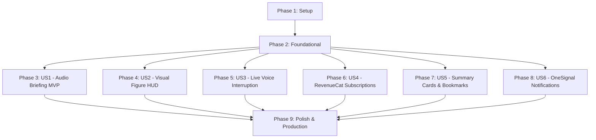

# Tasks: PaperPod Core — Interactive 2-Host AI Audio Research Companion

**Input**: Design documents from `/specs/001-paperpod-core/` (`plan.md`, `spec.md`, `data-model.md`, `contracts/`, `research.md`, `quickstart.md`)  
**Prerequisites**: `plan.md` (required), `spec.md` (required), `data-model.md`, `contracts/`  
**Tech Stack**: React Native (Expo) TypeScript Client, Python (FastAPI) Backend, Supabase (PostgreSQL + pgvector + Storage), Gemini 3.1 Flash Lite (`gemini-3.1-flash-lite`), Edge-TTS, RevenueCat SDK, OneSignal SDK.

---

## Phase 1: Setup & Monorepo Initialization

**Purpose**: Establish workspace directories, dependencies, linting, and environment configs for both client and backend.

- [x] T001 Initialize project structure with `backend/` and `client/` directories per plan.md
- [x] T002 Initialize Python backend virtual environment and dependencies in `backend/requirements.txt` (`fastapi`, `uvicorn`, `pymupdf`, `pdfplumber`, `openai`, `edge-tts`, `supabase`, `pydantic`, `pytest`, `pytest-asyncio`, `httpx`, `python-dotenv`, `beautifulsoup4`)
- [x] T003 [P] Initialize Expo React Native TypeScript project in `client/package.json` with Expo SDK 57 (`expo@~57.0.14`), React Native 0.86.2, React 19.2, Reanimated, Expo Audio/AV, Lucide Icons, and `@supabase/supabase-js`
- [x] T004 [P] Configure backend linting and formatting in `backend/pyproject.toml`
- [x] T005 [P] Configure client TypeScript compiler in `client/tsconfig.json` and linter in `client/.eslintrc.js`
- [x] T006 [P] Create backend environment template in `backend/.env.example`
- [x] T007 [P] Create client environment template in `client/.env.example`

---

## Phase 2: Foundational Infrastructure (Blocking Prerequisites)

**Purpose**: Core database schema, storage buckets, shared type contracts, and configuration modules that ALL user stories depend on.

**⚠️ CRITICAL**: Must complete before implementing any User Story.

- [x] T008 Create Supabase SQL migration script for all tables (`users`, `user_entitlements`, `papers`, `paper_sections`, `paper_figures`, `episodes`, `episode_dialogue_segments`, `voice_interruption_logs`, `summary_cards`, `audio_bookmarks`) and `pgvector` extension in `backend/migrations/001_initial_schema.sql`
- [x] T009 Create Supabase Storage bucket initialization script for `papers`, `figures`, and `audio` buckets with public read policies in `backend/migrations/002_storage_buckets.sql`
- [x] T010 [P] Implement backend configuration loader and environment settings in `backend/src/core/config.py`
- [x] T011 [P] Implement backend Supabase client wrapper and database helper in `backend/src/core/supabase_client.py`
- [x] T012 [P] Implement shared Pydantic data schemas in `backend/src/models/schemas.py`
- [x] T013 [P] Implement shared TypeScript data types and API response interfaces in `client/src/types/index.ts`
- [x] T014 [P] Implement client Supabase client singleton and auth listeners in `client/src/services/supabase.ts`
- [x] T015 [P] Create test fixtures repository with sample arXiv PDF (`1706.03762`), extracted JSON, and mock audio in `backend/tests/fixtures/sample_paper.pdf`
- [x] T016 Setup FastAPI application entry point, CORS middleware, and healthcheck router in `backend/src/main.py`

**Checkpoint**: Core database, storage, schemas, and API foundation ready.

---

## Phase 3: User Story 1 (P1) — Paper Ingestion & Conversational 2-Host Audio Briefing 🎯 MVP

**Goal**: Ingest PDF/arXiv research papers, parse sections, generate a 2-host conversational script with plain-language math analogies using `gemini-3.1-flash-lite`, synthesize studio-grade neural audio with timing markers, and provide a full-featured audio player.

**Independent Test**: Upload `sample_paper.pdf` or submit arXiv link `https://arxiv.org/abs/1706.03762`, verify generation of a multi-speaker audio episode, and test play, pause, seek, and playback speed adjustment.

### Tests for User Story 1

- [x] T017 [P] [US1] Unit test for PDF layout parsing and LaTeX equation extraction in `backend/tests/unit/test_parser.py`
- [x] T018 [P] [US1] Unit test for Gemini 3.1 Flash Lite 2-host script prompt formatting and structured JSON output in `backend/tests/unit/test_script_gen.py`
- [x] T019 [P] [US1] Contract test for `/api/v1/papers/upload` and `/api/v1/papers/arxiv` in `backend/tests/contract/test_ingestion_api.py`

### Implementation for User Story 1

- [x] T020 [P] [US1] Implement PyMuPDF document parser to extract metadata, two-column text sections, and LaTeX equations in `backend/src/services/parser.py`
- [x] T021 [P] [US1] Implement arXiv fetching service using BeautifulSoup and urllib in `backend/src/services/arxiv_fetcher.py`
- [x] T022 [US1] Implement Gemini 3.1 Flash Lite (`gemini-3.1-flash-lite`) conversational script generator converting technical sections and math notation into 2-host dialogue (Alex & Dr. Taylor) in `backend/src/services/script_gen.py`
- [x] T023 [US1] Implement multi-voice Edge-TTS synthesizer generating synchronized word/sentence audio offsets in `backend/src/services/audio_tts.py`
- [x] T024 [US1] Implement paper ingestion and episode generation endpoints in `backend/src/api/papers.py`
- [x] T025 [P] [US1] Implement client API service for paper upload and arXiv import in `client/src/services/api.ts`
- [x] T026 [P] [US1] Implement client Audio Player engine with Expo Audio supporting play, pause, seek, buffer state, and 0.75x–2.0x playback speed in `client/src/services/audioPlayer.ts`
- [x] T027 [US1] Implement Paper Ingestion screen with URL input, PDF upload dropzone, and extraction progress skeleton in `client/src/screens/HomeScreen.tsx`
- [x] T028 [US1] Implement Interactive Audio Player Screen with tactile scrubber, host avatar indicators, and interactive transcript highlight in `client/src/screens/PlayerScreen.tsx`
- [x] T029 [US1] Implement animated waveform visualizer component in `client/src/components/audio/WaveformVisualizer.tsx`

**Checkpoint**: User Story 1 complete — End-to-end PDF/arXiv ingestion to 2-host conversational audio playback functional.

---

## Phase 4: User Story 2 (P1) — Synchronized Visual Figure HUD

**Goal**: Automatically extract figures, charts, and tables with bounding box coordinates, upload high-res crops to storage, and dynamically highlight and auto-zoom the visual HUD at the exact timestamp referenced in the audio briefing.

**Independent Test**: Play an episode discussing "Figure 1", verify the HUD smoothly slides into view with the correct crop and caption within 500ms, and verify pinch-to-zoom and panning touch gestures.

### Tests for User Story 2

- [x] T030 [P] [US2] Unit test for vector/raster figure cropping and coordinate calculation in `backend/tests/unit/test_figure_cropper.py`
- [x] T031 [P] [US2] Contract test for `/api/v1/episodes/{episode_id}/timeline` in `backend/tests/contract/test_audio_api.py`

### Implementation for User Story 2

- [x] T032 [P] [US2] Implement high-DPI figure cropper and Supabase Storage uploader in `backend/src/services/figure_extractor.py`
- [x] T033 [US2] Implement episode timeline metadata generator linking dialogue turns to figure IDs and audio timestamps in `backend/src/services/timeline_service.py`
- [x] T034 [US2] Implement timeline endpoint `/api/v1/episodes/{episode_id}/timeline` in `backend/src/api/episodes.py`
- [x] T035 [P] [US2] Implement Synchronized Figure HUD container with active figure auto-detection from playback timestamp in `client/src/components/hud/FigureHud.tsx`
- [x] T036 [US2] Implement tactile pinch-to-zoom, pan, and double-tap reset gestures using React Native Reanimated in `client/src/components/hud/ZoomableFigure.tsx`
- [x] T037 [US2] Implement Figure Gallery drawer allowing users to browse all paper figures and tap to jump audio scrubber to that timestamp in `client/src/components/hud/FigureGallery.tsx`
- [x] T038 [US2] Integrate Figure HUD into PlayerScreen layout with split view and full-screen expansion modes in `client/src/screens/PlayerScreen.tsx`

**Checkpoint**: User Stories 1 and 2 complete — Conversational audio and Synchronized Visual HUD fully synchronized.

---

## Phase 5: User Story 3 (P2) — Live Voice Interruption & In-Context Clarification

**Goal**: Allow users to tap the mic or interrupt during playback ("Wait, explain equation 4!"), seamlessly pause audio, query the paper's section vectors using pgvector + Gemini 3.1 Flash Lite, speak a 2-sentence intuitive clarification from Dr. Taylor, and resume audio.

**Independent Test**: Trigger voice interruption during playback, submit sample question, verify playback pauses, Dr. Taylor responds in <1.5s with clarifying speech, and main audio resumes seamlessly.

### Tests for User Story 3

- [x] T039 [P] [US3] Unit test for section vector embedding and similarity search in `backend/tests/unit/test_rag.py`
- [x] T040 [P] [US3] Contract test for `/api/v1/episodes/{episode_id}/interrupt` in `backend/tests/contract/test_interruption_api.py`

### Implementation for User Story 3

- [x] T041 [P] [US3] Implement paper section embedding generator using text embedding model in `backend/src/services/embeddings.py`
- [x] T042 [US3] Implement Interruption Q&A RAG engine using Gemini 3.1 Flash Lite (`gemini-3.1-flash-lite`) retrieving relevant paper context and generating concise host clarification dialogue in `backend/src/services/interruption.py`
- [x] T043 [US3] Implement rapid single-turn neural TTS generation for clarification answers in `backend/src/services/interruption_tts.py`
- [x] T044 [US3] Implement live voice interruption endpoint `/api/v1/episodes/{episode_id}/interrupt` in `backend/src/api/interruption.py`
- [x] T045 [P] [US3] Implement client Interruption State Machine (`PLAYING` $\rightarrow$ `RECORDING` $\rightarrow$ `CLARIFYING` $\rightarrow$ `RESUMING`) in `client/src/services/interruptionManager.ts`
- [x] T046 [US3] Implement Voice Recording modal / Text input fallback sheet with haptic feedback in `client/src/components/interruption/VoiceInterruptModal.tsx`
- [x] T047 [US3] Implement Host Clarification floating bubble showing animated Dr. Taylor avatar and spoken audio playback in `client/src/components/interruption/ClarificationBubble.tsx`

**Checkpoint**: Live Voice Interruption fully functional with seamless audio pause, RAG clarification, and auto-resume.

---

## Phase 6: User Story 4 (P2) — RevenueCat Monetization, Subscriptions & Dynamic Paywalls

**Goal**: Implement full RevenueCat SDK integration with local StoreKit sandbox testing ($0 cost), dynamic paywall templates (Paywalls v2), contextual upgrade triggers on quota limits, and Customer Center subscription management.

**Independent Test**: Trigger a 2nd voice interruption on a free account, verify the dynamic paywall appears, complete a simulated sandbox purchase, and verify instant unlock of unlimited voice questions and deep dives.

### Tests for User Story 4

- [ ] T048 [P] [US4] Unit test for user entitlement verification and quota counters in `backend/tests/unit/test_entitlements.py`
- [ ] T049 [P] [US4] Unit test for RevenueCat webhook handler and entitlement synchronization in `backend/tests/unit/test_revenuecat_sync.py`

### Implementation for User Story 4

- [ ] T050 [P] [US4] Create RevenueCat StoreKit configuration file for local $0 sandbox testing (`paperpod_pro_monthly`, `paperpod_pro_annual`, `paperpod_student_lifetime`) in `client/PaperPod.storekit`
- [ ] T051 [P] [US4] Implement RevenueCat Purchases SDK wrapper, offering loader, and purchaser info listener in `client/src/services/purchases.ts`
- [ ] T052 [US4] Implement user entitlement context and quota tracker hook (`useEntitlements`) in `client/src/context/EntitlementContext.tsx`
- [ ] T053 [US4] Implement Dynamic Paywall v2 modal component with student discount toggle in `client/src/components/paywall/PaywallModal.tsx`
- [ ] T054 [US4] Implement contextual paywall trigger hooks for second voice interruption, 3rd weekly paper conversion, and offline download in `client/src/hooks/usePaywallTrigger.ts`
- [ ] T055 [US4] Implement Customer Center screen with active plan details, change plan options, and restore purchases button in `client/src/screens/CustomerCenterScreen.tsx`
- [ ] T056 [US4] Implement backend RevenueCat webhook endpoint to sync subscription events with Supabase `user_entitlements` in `backend/src/api/webhooks.py`

**Checkpoint**: Monetization architecture complete with working StoreKit sandbox, dynamic paywalls, and Customer Center.

---

## Phase 7: User Story 5 (P3) — 1-Tap High-Density Summary Cards & Audio Bookmarks

**Goal**: Generate high-density 1-page visual summary cards containing Core Thesis, Key Quantitative Benchmarks, Limitations, and Future Work, and allow users to save timestamped audio bookmarks during playback.

**Independent Test**: Tap "Generate Summary Card" on an ingested paper, view the structured card with extracted benchmark metrics, add an audio bookmark at 01:45, and verify bookmark export.

### Tests for User Story 5

- [ ] T057 [P] [US5] Unit test for summary card structured extraction and benchmark parsing in `backend/tests/unit/test_summary_gen.py`

### Implementation for User Story 5

- [ ] T058 [P] [US5] Implement Gemini 3.1 Flash Lite summary card generator extracting thesis, quantitative results table, and limitations in `backend/src/services/summary_gen.py`
- [ ] T059 [US5] Implement summary card and bookmark endpoints in `backend/src/api/summaries.py`
- [ ] T060 [P] [US5] Implement Audio Bookmark action button and interactive timeline markers in `client/src/components/audio/AudioBookmarkBar.tsx`
- [ ] T061 [US5] Implement High-Density Summary Card modal with printable/shareable visual layout in `client/src/components/summary/SummaryCardModal.tsx`
- [ ] T062 [US5] Implement export / share summary card as image or PDF in `client/src/services/exportService.ts`

**Checkpoint**: 1-Tap Summary Cards and Audio Bookmarks operational.

---

## Phase 8: User Story 6 (P3) — Spaced Research Reminders & Daily Topic Digests

**Goal**: Integrate OneSignal SDK for scheduled push notifications, research category subscriptions (AI, Robotics, Bio, etc.), and deep-linking directly into paper audio playback.

**Independent Test**: Subscribe to "Artificial Intelligence", trigger a simulated topic digest push alert, tap the notification, and verify app launches directly into the featured paper audio player.

### Tests for User Story 6

- [ ] T063 [P] [US6] Unit test for notification scheduling and deep-link payload generation in `backend/tests/unit/test_notifications.py`

### Implementation for User Story 6

- [ ] T064 [P] [US6] Implement OneSignal notification scheduler for topic digests and study reminders in `backend/src/services/notification_service.py`
- [ ] T065 [P] [US6] Implement OneSignal Mobile SDK initialization and permission handler in `client/src/services/notifications.ts`
- [ ] T066 [US6] Implement Topic Preference & Digest Settings screen in `client/src/screens/TopicDigestSettingsScreen.tsx`
- [ ] T067 [US6] Implement deep-link notification routing resolving payload parameters to active player navigation in `client/src/navigation/deepLinkHandler.ts`

**Checkpoint**: OneSignal notifications and deep-linking operational.

---

## Phase 9: Polish, Performance & Production Readiness

**Purpose**: Cross-cutting aesthetic polish, memory optimization, offline caching, test validation, and Hackathon submission assets.

- [ ] T068 [P] Implement rich Dark and Light themes with tailored typography, glassmorphism accents, and accessible contrast in `client/src/theme/index.ts`
- [ ] T069 [P] Implement offline caching service for audio files and figure assets using Expo FileSystem in `client/src/services/offlineCache.ts`
- [ ] T070 [P] Execute end-to-end integration test suite verifying paper upload $\rightarrow$ audio generation $\rightarrow$ figure HUD sync $\rightarrow$ voice interruption in `backend/tests/integration/test_e2e_pipeline.py`
- [ ] T071 [P] Create Dockerfile and deployment script for backend service in `backend/Dockerfile` and `backend/docker-compose.yml`
- [ ] T072 [P] Create Expo Application configuration and build profiles in `client/app.json` and `client/eas.json`
- [ ] T073 [P] Generate Devpost submission assets (1024x1024 app icon, 1179x2556 screenshots) in `docs/assets/`
- [ ] T074 Execute quickstart.md validation to confirm end-to-end reproducibility

---

## Dependencies & Execution Order

### Parallel Opportunities

- **Phase 1 (Setup)**: T003, T004, T005, T006, T007 can execute in parallel.
- **Phase 2 (Foundational)**: T010, T011, T012, T013, T014, T015 can execute in parallel after T008/T009.
- **Phase 3 (US1)**: Backend parser (T020, T021) and Client player (T025, T026) can build concurrently.
- **Phase 4 (US2)**: Figure cropper (T032) and Client HUD component (T035, T036) can build concurrently.
- **Phase 5 (US3)**: Embedding generator (T041) and Client State Machine (T045, T046) can build concurrently.
- **Phase 6 (US4)**: StoreKit sandbox (T050) and Purchases SDK wrapper (T051) can build concurrently.
- **Phase 7 (US5)**: Summary generator (T058) and Bookmark bar (T060) can build concurrently.
- **Phase 8 (US6)**: Notification service (T064) and OneSignal client (T065) can build concurrently.
- **Phase 9 (Polish)**: T068, T069, T070, T071, T072, T073 can execute in parallel.

---

## Implementation Strategy

### MVP Milestone (Phases 1, 2, and 3)
1. Complete Setup (T001–T007) and Foundational (T008–T016).
2. Implement Phase 3 (US1: Paper Ingestion & Audio Briefing).
3. Validate MVP: Ingest sample paper, generate 2-host audio, play with waveform scrubber.

### Full Production Delivery (Phases 4 through 9)
4. Add Phase 4 (US2: Synchronized Visual Figure HUD).
5. Add Phase 5 (US3: Live Voice Interruption).
6. Add Phase 6 (US4: RevenueCat Paywalls v2 & Subscriptions).
7. Add Phase 7 (US5: Summary Cards) & Phase 8 (US6: Notifications).
8. Final Polish (Phase 9: Themes, offline cache, end-to-end test verification, Devpost assets).
